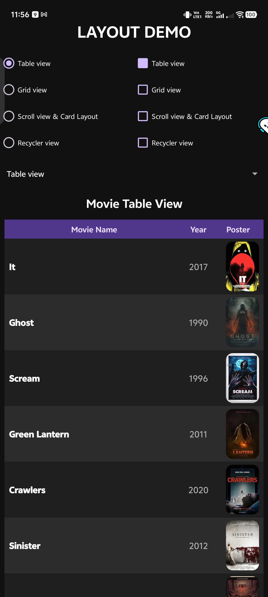
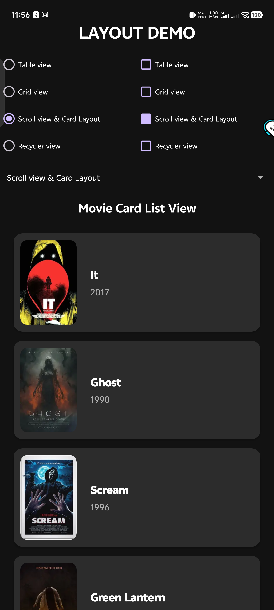

# Movie Catalog UI

Premium Material 3 Android application built with Kotlin. Demonstrates advanced UI synchronization and multi-view layout architectures.

## Key Features
*   **Multi-View Architecture**: Toggle between Table, Grid, Card, and Recycler views using Fragments.
*   **Triple-Controller Synchronization**: Real-time sync between RadioButtons, CheckBoxes, and a Spinner. Selecting an option in one updates all others automatically.
*   **Premium Dark Theme**: High-contrast Material 3 dark palette.
*   **Audited Codebase**: Zero unused XML or Kotlin files. Optimized resource management.

## UI Sync Logic
Robust state management using an `isUpdating` flag to prevent recursive listener triggers. Ensures consistent UI state across all inputs (RadioGroup, CheckBoxes, Spinner).

## Technical Audit
*   Zero redundant layout XML files.
*   Zero unused Kotlin classes or imports.
*   100% density-independent scaling (dp).
*   All strings extracted to `strings.xml`.

## Screenshots

  
  

  
  

## Technical Stack
*   **Language**: Kotlin
*   **UI Framework**: Android XML / Material 3
*   **Architecture**: Fragment-based single activity
*   **Tools**: Android Studio, ADB, Android Lint
